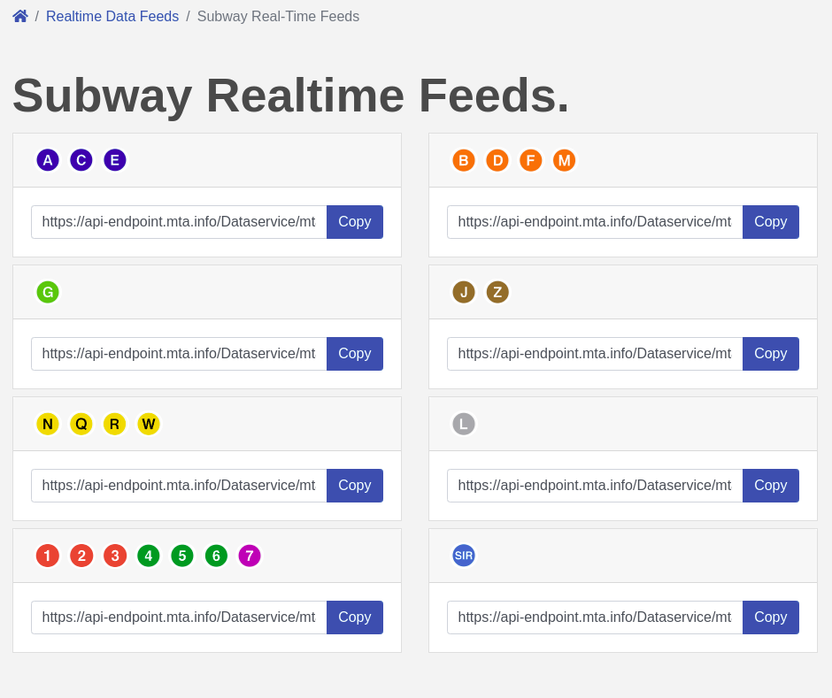

<p align="center">

</p>

# GoMTA

Go bindings to the Metropolitan Transportation Authority General Transit Feed Specification API.

<br>

<h3>🔑 Authentication</h3>

Before using this library make sure to sign up at the MTA's developer portal and get an access token from [https://api.mta.info/#/landing](https://api.mta.info/#/landing)

<br>

<h3> ⭐ API Endpoints</h3>

Currently only Subway Realtime Feeds are only supported.



<br>

<h3> 🚏 Stations </h3>

Under the google_transit folder the MTA GTFS dataset is present. For general usage the stops.txt folder displays stop codes for all of the subway stops of the NYC Subway system. More info about how the GTFS files work can be found here [https://developers.google.com/transit/gtfs/reference](https://developers.google.com/transit/gtfs/reference)


<br>

<h3>Example</h3>

```go

func main() {

    // Initialize the client

	mtaclient := NewClient(
		"ACCESS_KEY",
	)

    // Specify the URL

    url := "https://api-endpoint.mta.info/Dataservice/mtagtfsfeeds/nyct%2Fgtfs-ace"

    // Retrieve the Feed

	mta := mtaclient.getFeed(url)

    // Filter

	x := mta.stopTimeUpdate.filter("A02N")

	for _, item := range x {
		fmt.Println(item)
	}

}
```
